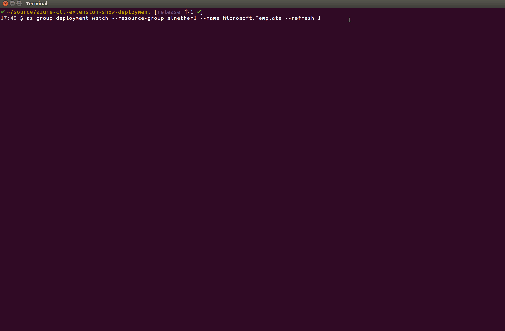
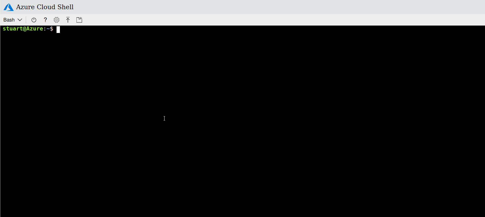

# az-cli-extension-show-deployment
An extension for the Azure CLI to show ARM deployment progress

[](https://ci.appveyor.com/project/stuartleeks/az-cli-extension-show-deployment/branch/release)


## Installing

### Install from the web

To install the extension, simply execute the following `az` command:

```bash
az extension add --source https://azclishowdeployment.blob.core.windows.net/releases/dist/show_deployment-0.0.7-py2.py3-none-any.whl
```

Note if you have previously installed and are updating then uninstall first via `az extension remove --name show-deployment`


### Download and install
If you prefer, you can download the extension and then install. The latest release can be downloaded from https://azclishowdeployment.blob.core.windows.net/releases/dist/show_deployment-0.0.7-py2.py3-none-any.whl

Then run the following (fixing the path to the downloaded file as required)

```bash
az extension add --source ~/Downloads/show_deployment-0.0.7-py2.py3-none-any.whl 
```

## Running

To show the status of the latest deployment to `your-resource-group` run:

```
az group deployment watch --resource-group your-resource-group
```

You can select which deployment to watch by name:

```
az group deployment watch --resource-group your-resource-group --name some-deployment
```

## See it in action...







## Changelog

### 2018-07-02 v0.0.7

FIX: error if message is string containing 'details' 

Continue to refresh on 'Accepted' state 

### 2018-06-29 v0.0.06

Add error output for Deployment Output evaluation step

### 2018-06-29 v0.0.5

Add deeper error output

### 2018-06-14 v0.0.4

Add output of operation errors

### 2018-06-06 v0.0.3

Check multiple properties to find duration as JSON structure varies across Azure CLI versions

### 2018-05-25 v0.0.2

Fix up duration parsing in az cli response JSON